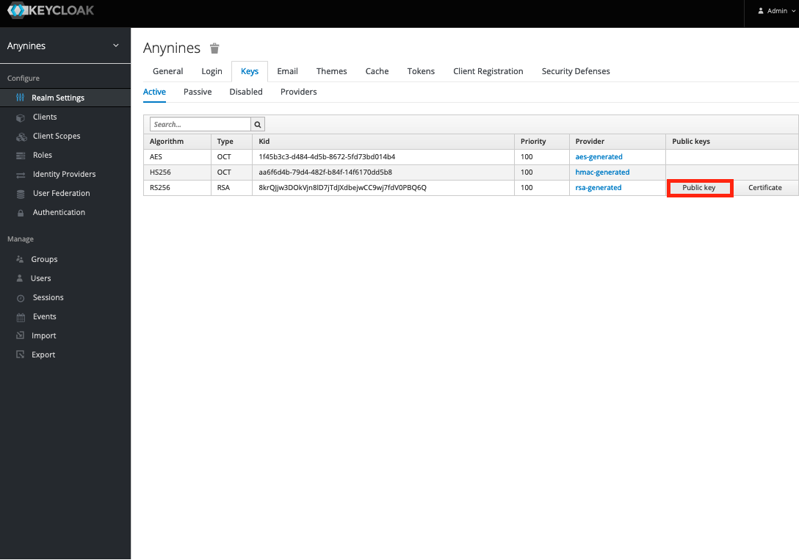
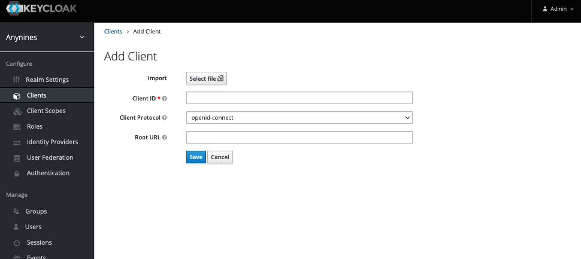
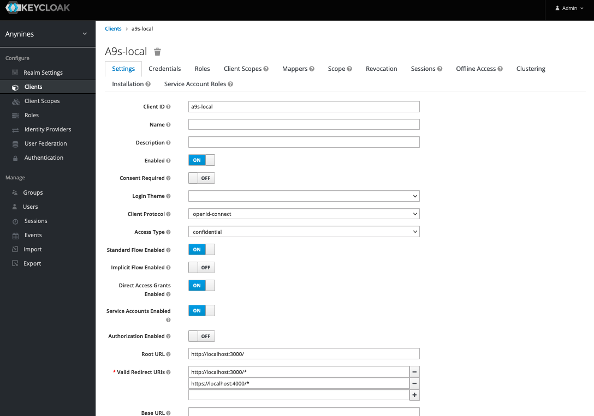
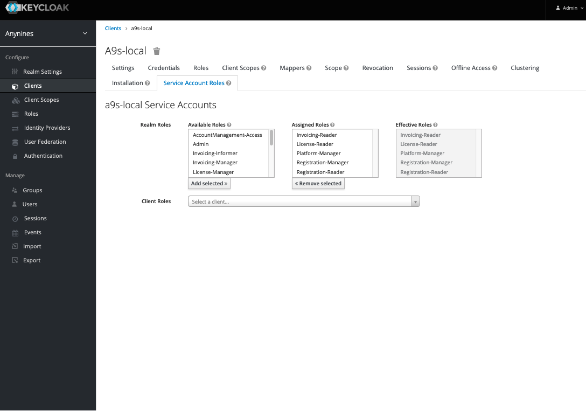
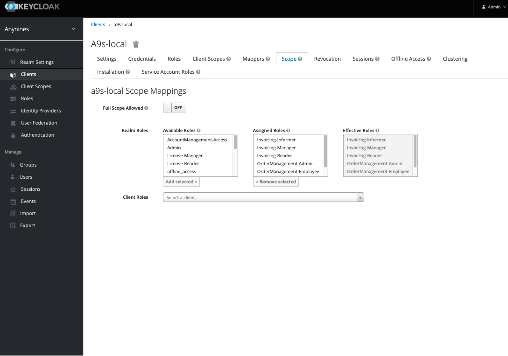
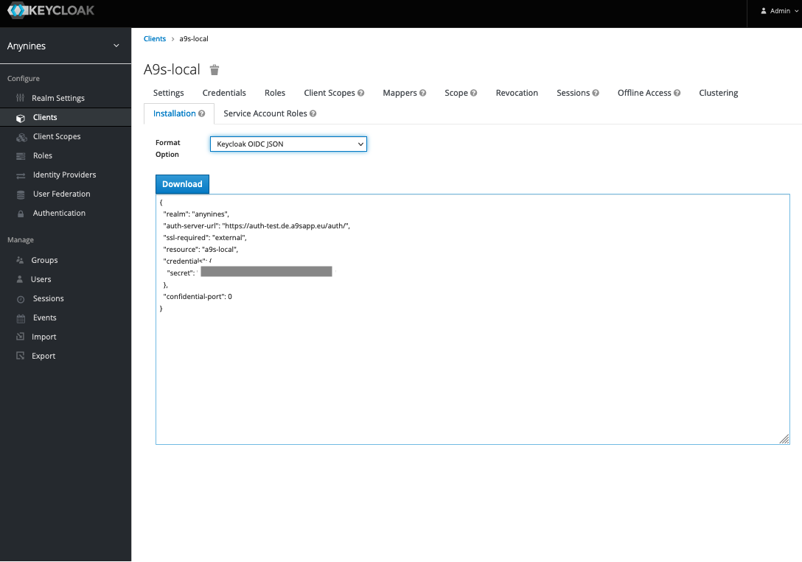

# OmniauthKeycloak

## Installation

You can install the Keycloak Client as OmniAuth Strategy to integrate it.
This is usefull to operate with devise.

Or you can use it as Standalone authentification if you want to use Keycloak only authentifications.


## Requirements

In order to use the Keycloak Integration, you need an so called **OIDC-JSON** and the Keycloak **public key**.
To obtain them, there are several Steps required which are explained in the following.

### Keycloak Public Key

At the current state of this gem, auto fetching of Public keys via JWKS are not full implemented.
Therefore we need to preshare the key to all clients.

The Keycloak Public key can get obtain in the general Realm settings under  **Keys**




### Create a Client
The OIDC-JSON includes the pre shared secrets for your app and it represents a **client** within Keycloak.

To obtain a OIDC-JSON, first create a client within the Keycloak admin console.
Each service to integrate to keycloak will require an own client.



Choose a Client-ID for your application.

#### Client Settings



Open the Client Settings, and set **Access Type** to **confidential**.

Enter under **Valid Redirect URIs** the URI to your service. Wildcards in the path are allowed.
This is mandatory, any failure in the URI definition will result in denied logins.

If your service also want to identify itself to other services, set **Service Accounts Enabled** to **On**.
This Service Account can now get assigned to Scopes to authenticate against other clients.
See [Request Token to make Calls](#request-token-to-make-calls) how to use a **Service Account** with this gem.



#### Client Scopes



Under **Scopes** you can define, which scope-permissions will be included within the JWT token, the service
willr etreive from Keycloak.
If **Full Scope Allowed** is set to **On**, the JWT token will include all scopes a User has within the Realm.


#### Client Installation


In **Installation** you can then access the final **OIDC-JSON** for your service.


## Secure your Application/Service with Keycloak

After you integrate OAuth in your service successfully, you can authenticate  with your keycloak account.
You don't need to set up a new database, you can still use the old database.
The implementation matches up the email from your keycloak account with your service account.


### Rails

Add the OmniAuth gem to the Gemile of your application:

```ruby
gem 'omniauth-keycloak', git: 'git@github.com:avarteqgmbh/omniauth-keycloak.git'
```

Add following initializer.
Take the OIDC-JSON from Keycloak.
Also define the Public key from keycloak under the env variable.
You can do so by unsing the gem [envyable](https://github.com/philnash/envyable) locally.

An .env.yml can look like:
```yaml
keycloak_public_key: '<your public key>'
```

```ruby
OmniauthKeycloak.init( <OIDC-JSON> ) do |config|
  config.allowed_realm_roles  = ['Admin']
  config.allowed_client_roles = ['admin']
  config.token_cache_expires_in = 10.minutes
  config.allowed_client_roles_api =['admin']
  config.allowed_realm_roles_api  =['admin']
end
```

**Attention** If you get an 404 from Keycloak during login attempts, the auth URL have maybe changed.
You can set it manually with the env variable **keycloak_authorize_url**.

```yaml
keycloak_public_key:     '<your public key>'
keycloak_authorize_url:  'https://your-keycloak.url/realms/<your realm>/protocol/openid-connect/auth'
keycloak_token_endpoint: 'https://your-keycloak.url/realms/<your realm>/protocol/openid-connect/token'
```

**Attention** If you get a `Invalid issuer` from Keycloak during login attempts, the server prefix may have changed.
You can set it manually with the env variable **keycloak_server_prefix**. When you ommit this config, it's set to `auth`

```yaml
keycloak_server_prefix:     '<your prefix>'
```


Mount the engine into your routes.rb
You will maybe cover old views with session_path helpers.

```
delete 'logout', to:'omniauth_keycloak/sessions#logout_user', as: 'session'
mount OmniauthKeycloak::Engine  => '/auth'
```


If you got Problems with **omniauth_keycloak/application_controller not found**
configure the eager_load_path in config/application.rb as follow:

```
  config.eager_load_paths += %W( #{OmniauthKeycloak.config.root}/app/controllers )
```

#### Secure API Services

Just include the ```OmniauthKeycloak::ApiControllerExtension``` into the API Base Controller or ApplicationController.
After that, every call against the service has to be authenticated against Keycloak.

Don't forget to set the allowed roles for API Access into the initializer.

```ruby
class ApplicationController < ActionController::Base
  include OmniauthKeycloak::ApiControllerExtension
  …

```

#### Extended Helper Methods

If you neet an integration for end users of the service, please prefer ```OmniauthKeycloak::ControllerExtension```
over ```OmniauthKeycloak::ApiControllerExtension```.

This extension introduces the method ```current_user``` to the Service as helper method to access the
JWT Token of the logged in user / client.


```ruby
class ApplicationController < ActionController::Base
  include OmniauthKeycloak::ControllerExtension
  …

```


### Integrate to Devise

The Integration to an Devise setup is a littlebit different from the Omniauth only workflow, se we will explain here from the beginning how to set it up.

Add the OmniAuth gem to the Gemile of your application:

```ruby
gem 'omniauth-keycloak', git: 'git@github.com:avarteqgmbh/omniauth-keycloak.git'
```

Then run ```bundle install```

Next, you need to add the 2 columns "provider" (string) and "uid" (string) to your ```User``` model (use the class name for the application's users).
You can generate the migration with

```ruby
rails g migration AddOmniauthToUsers provider:string uid:string
```
and run ```rake db:migrate``` after that.

Next up, you need to declare the Keycloak provider and also add the initializer for the OIDC-JSON in ```config/initializers/devise.rb```:

```ruby
OmniauthKeycloak.init( ENV["<OIDC-JSON>"] ) do |config|
  config.allowed_realm_roles  = [ <ROLES> ]
  config.allowed_client_roles = [ <ROLES> ]
  config.token_cache_expires_in = 10.minutes
  config.allowed_client_roles_api =[ <ROLES> ]
  config.allowed_realm_roles_api  =[ <ROLES> ]
end

config.omniauth(:keycloak, OmniauthKeycloak.config.client_id, OmniauthKeycloak.config.client_secret, {
    scope:      OmniauthKeycloak.config.scope,
    public_key: OmniauthKeycloak.config.public_key,
    client_options: {
      site:          OmniauthKeycloak.config.url,
      authorize_url: OmniauthKeycloak.config.authorize_url,
      token_url:     OmniauthKeycloak.config.token_endpoint
    }
  })
```

Add for <OIDC-JSON> the environment variable name for the OIDC-JSON from Keycloak and define the allowed roles in <ROLES>.
All necessary informations are loaded from the environment variable by the ```omniauth-keycloak``` engine.

Example for environment file as ```env.yml```:

```yaml
keycloak_oidc_json: OIDC-JSON from Keycloak

keycloak_public_key: public key from Keycloak
```

After configuring your strategy, you need to add the omniauth option to your model in  ```app/models/user.rb```:

```ruby
devise :omniauthable
```

Also mount the engine into your ```routes.rb```. If the routes are not loaded automatically, then add ```OmniauthKeycloak.config.load_routes``` to load the routes from the engine. Add ```controllers: { omniauth_callbacks: 'omniauth_callback' }``` to ```devise_for```, because the standard callback method from the omniauth-keycloak engine does not work with Devise.

```ruby
mount OmniauthKeycloak::Engine  => '/auth'
devise_for :users, controllers: { omniauth_callbacks: 'omniauth_callback' }
OmniauthKeycloak.config.load_routes
```

Next, create a new view for the login with Keycloak ```view/devise/sessions/new.html.erb```

```ruby
<%- if devise_mapping.omniauthable? %>
  <%- resource_class.omniauth_providers.each do |provider| %>
    <%= link_to "Sign in with #{provider.to_s.titleize}", omniauth_authorize_path(resource_name, provider) %><br />
  <% end -%>
<% end -%>
```

After this, we need to create a controller for the callbacks in ```app/controllers/omniauth_callbacks_controller.rb```

```ruby
class OmniauthCallbacksController < Devise::OmniauthCallbacksController
  include OmniauthKeycloak::OmniauthControllerExtension
  skip_before_filter :authenticate
  def callback
    acess_token 		= env['omniauth.auth']['credentials']['token']
    nonce           = env['omniauth.auth']['info']['original_nonce']
    refresh_token   = env['omniauth.auth']['credentials']['refresh_token']

    user = User.from_omniauth(auth_hash)

    begin
      token = OmniauthKeycloak::KeycloakToken.new(acess_token)
      token.verify!(nonce: nonce)

      if check_client_roles(token) or check_realm_roles(token)
        login(token,refresh_token)
        OmniauthKeycloak.log('Redirect after login')
        if OmniauthKeycloak.config.login_redirect_url
          sign_in_and_redirect :user, user
        else
          sign_in :user, user
          redirect_to main_app.root_path
        end
      else
        OmniauthKeycloak.log('Access denied')
        flash.now[:error] = "Access denied"
        render :template => 'layouts/error'
      end

    rescue OmniauthKeycloak::KeycloakToken::InvalidToken => e
      OmniauthKeycloak.log(e)
      flash[:error] = "#{e}"
      render :template => 'layouts/error'
    end
  end

  alias_method :keycloak, :callback

  def failure
  end
  private

  def auth_hash
    request.env["omniauth.auth"]
  end
end
```

Finally, we need to implementent the from_omniauth method in the user model to find or create the user ```app/models/user.rb```

```ruby
class << self
  def from_omniauth(auth)
    user = where(email: auth.info.email).first || where(auth.slice(:provider, :uid).to_h).first || new
    user.tap do |this|
      this.update_attributes(
        provider: auth.provider,
        uid: auth.uid,
        email: auth.info.email)
    end
  end
end
```

Also add this method in ```app/models/user.rb``` to override the password requirement from Devise:

```ruby
def password_required?
  return false if provider.present?
  super
end
```

#### Multiple providers ####
You can configure multiple providers with different prefixes. Add the providers like this to your ```env.yaml```

```yaml
foo_keycloak_oidc_json: OIDC-JSON from Foo Keycloak
foo_keycloak_public_key: public key from Foo Keycloak

bar_keycloak_oidc_json: OIDC-JSON from Bar Keycloak
bar_keycloak_public_key: public key from Bar Keycloak
```
You need to update your controller callbacks to use the specific confing, instead of the general one. An easy way is to pass the config prefix via the controller method to the callback like so:
```ruby
  class Users::OmniauthcallbackController < Devise::OmniauthCallbacksController
    def callback(config_prefix = "")
      ...
      begin
        keycloak_config = ::OmniauthKeycloak::Configuration.new(ENV["#{config_prefix}keycloak_oidc_json"] , config_prefix)
        # additional config setup, like allowed roles
        token = OmniauthKeycloak::KeycloakToken.new(acess_token, keycloak_config)
        token.verify!(nonce: nonce)
      
      if check_client_roles(token, keycloak_config.allowed_client_roles) or check_realm_roles(token, keycloak_config.allowed_realm_roles)
        login(token, refresh_token, keycloak_config.token_cache_expires_in.minutes)
    end

    def foo
      callback("foo_")
    end

    def bar
      callback("bar_")
    end
  end
```
---
**NOTE**

Make sure to name your custom providers without "keycloak" in their name, otherwise they will not work. So "foo_keycloak" or "keycloak_bar" will not work.

---

#### Cookie size overflow

If you got problems with the cookie size, change the ```:cookie_store``` to ```:active_record_store``` in ```config/initializers/session_store.rb```.

```ruby
FancyVacations::Application.config.session_store :active_record_store, :key => '_your_app_session'
```

Include the ´´´gem 'activerecord-session_store'´´´ into your Gemfile:

```ruby
gem 'activerecord-session_store'
```

Run the migration generator for active_record and then run the migration:

```ruby
rails g active_record:session_migration
```

```ruby
rake db:migrate
```

## Login against Keycloak secured Services

If you want to Login against an already secured Service, you can use this gem to obtain a valid token
from given credentials or client secrets.

### Request Token to make Calls

Create a own full user for this calls and authenticate with user and password:
```ruby
token = OmniauthKeycloak::KeycloakToken.password(<user>,<password>)
```
Or

Use the Client Credentials to get a token.
Therefore you must activate the **Service Account**-Feature in the client settings.
You are also able to assign Roles to the Service accounts to ristrict the Service2Service access the same way.

```ruby
token = OmniauthKeycloak::KeycloakToken.client_credentials
```

### Integration within ActiveResource

The usage is very simple.
Install the omniauth-keycloak gem and use the Token-Client to generate a Bearer Token.

You must send this Token into the Authorization Header in Every HTTP Request

```Ruby
class Fancyness < ActiveResource::Base

  self.site     = 'https://test.avarteq.de'

  def self.create_fancy_stuff
    self.headers['Authorization'] = "Bearer #{OmniauthKeycloak::KeycloakToken.client_credentials.token}"
    response = self.create(:identifier => :disable_anynines_organization, :init_payload => organization.to_h)
  ....

```


## Known issues

 * JWKS Support not Implemented
 * No autoamtic lookup after OAuth2 End Points
