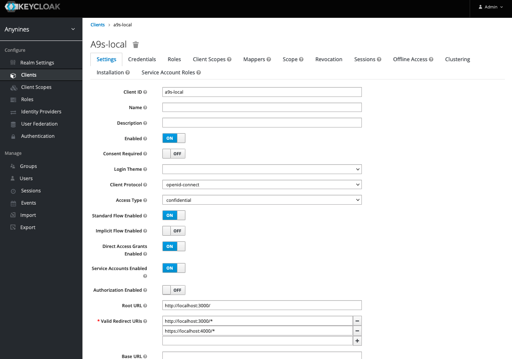

## Keycloak Setup

In order to use the Keycloak Integration, you need an so called **OIDC-JSON** and the Keycloak **public key**.
To obtain them, there are several Steps required which are explained in the following.

### Keycloak Public Key

At the current state of this gem, auto fetching of Public keys via JWKS are not full implemented.
Therefore we need to preshare the key to all clients.

The Keycloak Public key can get obtain in the general Realm settings under  **Keys**

### Create a Client
The OIDC-JSON includes the pre shared secrets for your app and it represents a **client** within Keycloak.

To obtain a OIDC-JSON, first create a client within the Keycloak admin console.
Each service to integrate to keycloak will require an own client.

Choose a Client-ID for your application.

#### Client Settings

Open the Client Settings, and set **Access Type** to **confidential**.

Enter under **Valid Redirect URIs** the URI to your service. Wildcards in the path are allowed.
This is mandatory, any failure in the URI definition will result in denied logins.

If your service also want to identify itself to other services, set **Service Accounts Enabled** to **On**.
This Service Account can now get assigned to Scopes to authenticate against other clients.
See [Request Token to make Calls](#request-token-to-make-calls) how to use a **Service Account** with this gem.

#### Client Scopes

Under **Scopes** you can define, which scope-permissions will be included within the JWT token, the service
willr etreive from Keycloak.
If **Full Scope Allowed** is set to **On**, the JWT token will include all scopes a User has within the Realm.

#### Client Installation

In **Installation** you can then access the final **OIDC-JSON** for your service.

